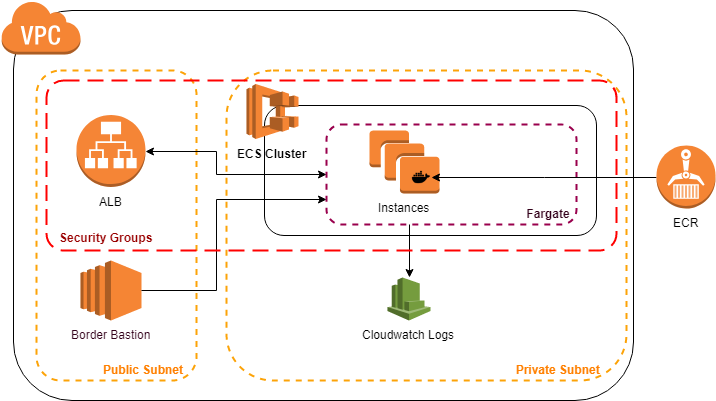

# AWs Cloudformation stack for ECS App
This repo contains three stacks in order to get a fully functional ECS cluster with a working service.
- VPC
- ECR 
- ECS

## Architecture


## Get Started

```sh
git clone https://github.com/HernanUrban/aws-cf-ecs-stack.git
```

### Pre-Requisites
- You need a [Key-Pair](https://docs.aws.amazon.com/AWSEC2/latest/UserGuide/ec2-key-pairs.html) pem created in order to connect to the bastion if needed.
- An [S3 bucket](https://docs.aws.amazon.com/AmazonS3/latest/user-guide/create-bucket.html) in order to upload the templates.  
Upload all this repo into the S3 bucket.  

### 1st Create a Docker Images Repository  
- Use the ecrStack.yam in order to create the docker images repository.  
- Upload a docker image that you want to deploy into the ECS cluster. [Reference](https://docs.aws.amazon.com/AmazonECR/latest/userguide/docker-push-ecr-image.html)  

### 2nd Create a Virtual Private Cloud  
- Use the vpc.yaml template in order to create the VPC for the project.  

### 3rd Create a the ECR cluster with a Fargate instance  
- Use the ecsStack.yaml template to create the project.
- Use the already created VPC ID when prompted.  
- Use the already created ECR and the image name/tag when prompted.  

